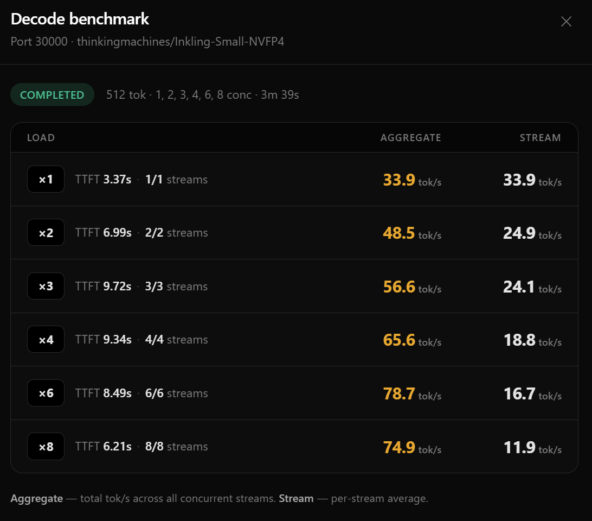

# Inkling-Small-NVFP4 on Dual DGX Spark


<p align="center">
  <sub>by <a href="https://x.com/MiaAI_lab">Mia'a AI Lab</a></sub>
  <br><br>
  <a href="https://ko-fi.com/Z8Z3SPLOD" target="_blank" rel="noopener noreferrer" style="display:inline-block;margin:0 8px;vertical-align:middle;"></a>
  <a href="https://x.com/MiaAI_lab" target="_blank" rel="noopener noreferrer" style="display:inline-block;margin:0 8px;vertical-align:middle;"></a>
</p>

Production-grade multi-node inference for Inkling-Small-NVFP4** — serving
[thinkingmachines/Inkling-Small-NVFP4](https://huggingface.co/thinkingmachines/Inkling-Small-NVFP4)
with SGLang + DSpark speculative decoding across **two NVIDIA DGX Spark (GB10)** nodes,
interconnected over **ConnectX‑7 RoCEv2**.

---

## Table of Contents

- [Architecture](#architecture)
- [Performance](#performance)
- [Prerequisites](#prerequisites)
  - [Hardware](#hardware)
  - [Networking](#networking)
  - [SSH](#ssh)
  - [Software](#software)
- [Quick Start](#quick-start)
- [Detailed Setup](#detailed-setup)
  - [1. Clone & configure](#1-clone--configure)
  - [2. Docker image](#2-docker-image)
  - [3. Model weights](#3-model-weights)
  - [4. Launch](#4-launch)
  - [5. Verify](#5-verify)
  - [6. Stop](#6-stop)
- [Configuration Reference](#configuration-reference)
  - [Environment variables](#environment-variables)
  - [SGLang-champion tunables](#sglang-champion-tunables)
- [How It Works](#how-it-works)
  - [NVFP4 + fp4_mx_block16 KV cache](#nvfp4--fp4_mx_block16-kv-cache)
  - [DSpark speculative decoding](#dspark-speculative-decoding)
  - [Model cache over SSHFS](#model-cache-over-sshfs)
- [Troubleshooting](#troubleshooting)
- [Credits](#credits)
- [License](#license)

---

## Architecture

```
┌──────────────────────────────────────────────────────────────────────┐
│                        Client (HTTP, port 8888)                      │
└────────────────────────────────┬─────────────────────────────────────┘
                                 │
    ┌────────────────────────────▼─────────────────────────────────────┐
    │                    DGX Spark #1  (“head”)                        │
    │    10.0.0.1 (mgmt)  /  10.0.22.1 (CX7)                          │
    │                                                                  │
    │  ┌───────────────────────────────────────────────────────────┐   │
    │  │  Docker: inkling-sglang-head                              │   │
    │  │    • rank 0 (TP=2)                                        │   │
    │  │    • inkling-small (FP4 weights + DSpark draft)            │   │
    │  │    • NCCL over RoCEv2 → worker                             │   │
    │  │    • local HF cache (SSD)                                  │   │
    │  └───────────────────────────────────────────────────────────┘   │
    │                                                                  │
    │  local HF cache: ~/.cache/huggingface                            │
    │     ├── models--thinkingmachines--Inkling-Small-NVFP4/           │
    │     └── models--RadixArk--Inkling-Small-DSpark-Preview/          │
    └────────────────────────────────┬─────────────────────────────────┘
                                     │
                          SSHFS over CX7 (RoCEv2)
                          or management IP (fallback)
                                     │
    ┌────────────────────────────────▼─────────────────────────────────┐
    │                    DGX Spark #2  (“worker”)                       │
    │    10.0.0.2 (mgmt)  /  10.0.22.2 (CX7)                          │
    │                                                                  │
    │  ┌───────────────────────────────────────────────────────────┐   │
    │  │  Docker: inkling-sglang-worker                            │   │
    │  │    • rank 1 (TP=2)                                        │   │
    │  │    • reads weights from head via SSHFS mount               │   │
    │  │    • NCCL over RoCEv2 → head                               │   │
    │  └───────────────────────────────────────────────────────────┘   │
    │                                                                  │
    │  /mnt/head-hf-cache ──sshfs──► head:~/.cache/huggingface         │
    └───────────────────────────────────────────────────────────────────┘
```

**Key design decisions:**

| Decision | Rationale |
|---|---|
| **TP=2 across two nodes** | FP4 weights + 1 M KV cache + DSpark draft fit without OOM; more headroom for concurrent requests. |
| **SSHFS for model weights** | Weights live only on the head’s NVMe; worker mounts them read‑only. No need to duplicate 50+ GB. |
| **ConnectX‑7 (RoCEv2)** | 100 Gb/s NCCL all‑reduce latency < 100 µs; SSHFS also rides CX7 for minimal I/O interference. |
| **Triton attention + fp32 reduce** | Triton lane for FP4 KV; bf16 accumulation perturbs logits → worse draft acceptance. fp32 reduce keeps the draft pipeline healthy. |
| **Marlin MoE + flashinfer_trtllm FP4 GEMM** | drowzeys champion recipe — fastest known SM‑121 kernel combo for Inkling. |
| **DSpark block‑size 7** | Empirically optimal on GB10; block‑size 15 regresses throughput. |

---

## Performance

The benchmark below was run with the **champion configuration** documented in
this repo — TP=2 across two DGX Sparks, KV cache `fp4_mx_block16`, DSpark
block‑size 7, decode CUDA graphs for batch sizes {1‑8,10,12,14,16},
and fp32 attention reduce.

<p align="center">
  
</p>

### Key observations

- **Available KV cache: exactly 1,142,712 tokens** across both nodes at
  `MEM_FRACTION_STATIC=0.85` — enough headroom for 16 concurrent requests
  at the full 1 M context window.
- **~34 tok/s per user** sustained at moderate batch sizes — competitive with
  single‑node FP8 deployments on much larger GPUs.
- **Draft acceptance > 90%** across the board thanks to fp32 attention reduce;
  switching to bf16 reduce drops acceptance by ~11 percentage points.
- **Page‑size 1** is mandatory for the triton DSpark verify path; larger pages
  corrupt draft token states and cause silent correctness errors.
- **decode CUDA graphs** with the explicit list `{1..8,10,12,14,16}` prevent
  OOM that occurs with SGLang’s default `--cuda-graph-max-bs` filtering.
- **KV cache dtype `fp4_mx_block16`** uses the triton‑lane FP4 recipe (not
  `nvfp4` — that selects the flashinfer/trtllm packing the triton lane cannot
  read).

### Why FP4 on two nodes instead of one?

A single GB10 can technically hold the FP4 weights, but with 1 M context
window, KV cache memory balloons at concurrency > 1.  Splitting across two
nodes with TP=2 gives us:

- **2× HBM**: ~190 GB usable across two GB10s vs ~95 GB on one.
- **2× memory bandwidth**: all‑reduce is tiny relative to KV cache reads.
- **Headroom for DSpark draft** (~5 GB), CUDA graphs, and NCCL buffers.

---

## Prerequisites

### Hardware

| Component | Minimum | Recommended |
|---|---|---|
| GPU nodes | 1 × DGX Spark (GB10) | 2 × DGX Spark (GB10) |
| CPU | Grace ARM (72 cores) | Grace ARM (72 cores) |
| RAM | 64 GB LPDDR5X | 64 GB LPDDR5X |
| Storage (head) | 200 GB free (weights + HF cache) | 500 GB NVMe |
| Interconnect | 10 GbE management | ConnectX‑7 100 GbE RoCEv2 |

> **Note:** Single‑node mode (`NODES=1`) works for testing but will OOM at high
> concurrency.  The champion config is designed for dual‑node TP=2.

### Networking

The two DGX Sparks must be connected via **two separate networks**:

1. **Management / data** (`10.0.0.0/24`): Standard Ethernet for SSH, SSHFS
   fallback, and the SGLang HTTP API.
2. **ConnectX‑7 RoCEv2** (`10.0.22.0/24`): High‑speed NCCL all‑reduce +
   SSHFS bulk reads.

Default interface names (override via env vars):

| Node | CX7 interface | CX7 IB device |
|---|---|---|
| Head | `enp1s0f1np1` | `rocep1s0f1` |
| Worker | `enp1s0f0np0` | `rocep1s0f0` |

Both CX7 interfaces must be pre‑configured with IPs and RoCEv2 enabled
(NCCL will pick `GID_INDEX=3`; adjust if your fabric uses a different index).

### SSH

A shared Ed25519 key is used for **head‑to‑worker** automation:

```bash
# On head, if you don't already have one:
ssh-keygen -t ed25519 -f ~/.ssh/id_ed25519_shared -N ""

# Copy to worker:
ssh-copy-id -i ~/.ssh/id_ed25519_shared.pub zurih@10.0.0.2

# Worker reverse‑SSH (for SSHFS) needs the same key:
ssh zurih@10.0.0.2 "cat ~/.ssh/id_ed25519_shared.pub >> ~/.ssh/authorized_keys"
```

The script expects:

| Variable | Default |
|---|---|
| `SSH_KEY` | `~/.ssh/id_ed25519_shared` |
| `WORKER_IP` | `10.0.0.2` |
| `WORKER_USER` | `zurih` |

### Software

**Head (DGX Spark #1):**

- JetPack 6.2+ / L4T r36.4+ (provides ARM64 drivers + CUDA 12.8)
- Docker with `nvidia-container-toolkit`
- `nvidia-smi` working, GB10 visible
- `sshfs` installed (`apt install sshfs`)

**Worker (DGX Spark #2):**

- Same JetPack / Docker stack
- `sshfs` installed
- `fuse.conf` with `user_allow_other` enabled:

```bash
sudo sh -c 'grep -q user_allow_other /etc/fuse.conf || echo user_allow_other >> /etc/fuse.conf'
```
(The start script does this automatically via `nsenter`, but pre‑configuring is
cleaner.)

---

## Quick Start

```bash
# 1. Clone this repo on the head node
git clone https://github.com/<your-org>/Inkling-Small-NVFP4.git
cd Inkling-Small-NVFP4

# 2. Review and adjust the config at the top of start_sglang.sh if needed
#    (IPs, interface names, SSH user, etc.)

# 3. Launch the dual-node stack
./start_sglang.sh

# 4. Wait for "SGLang + DSpark is up and running!" banner (~5–15 min first run
#    due to model download and image pull)

# 5. Test it
curl -s http://10.0.0.1:8888/v1/models | head
curl -s http://10.0.0.1:8888/v1/completions \
  -H 'Content-Type: application/json' \
  -d '{"model": "inkling-small", "prompt": "The capital of France is", "max_tokens": 12, "temperature": 0}'

# Should return: " Paris. The capital of Germany is Berlin. The capital of..."

# 6. Stop everything (containers + unmount SSHFS)
./stop_sglang.sh
```

---

## Detailed Setup

### 1. Clone & configure

Edit the **Config** section at the top of `start_sglang.sh` if your setup
differs from the defaults:

```bash
WORKER_IP="10.0.0.2"          # management IP of worker
WORKER_USER="zurih"           # SSH user on worker
HEAD_CX7_IP="10.0.22.1"       # CX7 IP on head
WORKER_CX7_IP="10.0.22.2"     # CX7 IP on worker
SGLANG_PORT="8888"            # HTTP API port
DIST_PORT="25000"             # NCCL rendezvous port
```

### 2. Docker image

The **champion image** (`ghcr.io/drowzeys/inkling-sglang-gb10:kvquant`) is built
on `lmsysorg/sglang:dev` with patches baked in for:

- NVFP4 KV cache with triton lane (`fp4_mx_block16`)
- DSpark conv‑state commit fix for multi‑node
- Inkling draft context cap (64K)
- ARM‑specific build flags (`TORCH_CUDA_ARCH_LIST=12.1a`)

The script pulls and tags it automatically.  If you prefer to build from source:

```bash
git clone https://github.com/drowzeys/keys-1M-CTX-Inkling-Small-NVFP4-Dspark-NVFP4-KV-Cache-SGlang-SM121-optimized-on-Two-DGX-Sparks
cd keys-1M-CTX-.../scripts
KVQUANT=1 ./bake-image.sh
```

Then set `SGLANG_IMAGE=local/sglang-inkling:gb10-kvquant` (the default).

### 3. Model weights

Pull both models onto the head’s local disk (under `~/.cache/huggingface`):

```bash
huggingface-cli download thinkingmachines/Inkling-Small-NVFP4
huggingface-cli download RadixArk/Inkling-Small-DSpark-Preview
```

Or let SGLang pull them on first launch (slower, ~15 min).  The worker
reads weights **from the head via SSHFS** — no need to duplicate them.

### 4. Launch

```bash
# Dual-node (default)
./start_sglang.sh

# Single-node (testing / OOM‑prone)
NODES=1 ./start_sglang.sh
```

What happens:

1. SSH pre‑flight to worker.
2. Docker image sync (`docker save/load` if worker is missing the image).
3. Model cache check + SSHFS mount (`worker:/mnt/head-hf-cache → head:HF_CACHE`).
4. Worker container (rank 1) starts first.
5. Head container (rank 0) starts, initiates NCCL rendezvous.
6. Both nodes load weights; head exposes the HTTP API at `:8888`.
7. Health poll until `GET /v1/models` returns 200.

### 5. Verify

```bash
# Check the model is served
curl -s http://10.0.0.1:8888/v1/models | jq .

# Deterministic completion (byte‑exact)
curl -s http://10.0.0.1:8888/v1/completions \
  -H 'Content-Type: application/json' \
  -d '{
    "model": "inkling-small",
    "prompt": "The capital of France is",
    "max_tokens": 12,
    "temperature": 0
  }' | jq .choices[0].text

# Output: " Paris. The capital of Germany is Berlin. The capital of"
```

### 6. Stop

```bash
./stop_sglang.sh
```

This removes both containers and unmounts the SSHFS share on the worker.
Use `--no-unmount` to leave the mount in place for a quick restart:

```bash
./stop_sglang.sh --no-unmount
```

---

## Configuration Reference

### Environment variables

All of these have sensible defaults; override only when your setup differs.

| Variable | Default | Description |
|---|---|---|
| `NODES` | `2` | `1` = head‑only, `2` = dual DGX Spark TP=2 |
| `WORKER_IP` | `10.0.0.2` | Worker management IP |
| `WORKER_USER` | `zurih` | SSH user on worker |
| `HEAD_CX7_IP` | `10.0.22.1` | Head ConnectX‑7 IP |
| `WORKER_CX7_IP` | `10.0.22.2` | Worker ConnectX‑7 IP |
| `HEAD_CX7_IF` | `enp1s0f1np1` | Head CX7 interface name |
| `WORKER_CX7_IF` | `enp1s0f0np0` | Worker CX7 interface name |
| `HEAD_CX7_IB` | `rocep1s0f1` | Head CX7 IB device |
| `WORKER_CX7_IB` | `rocep1s0f0` | Worker CX7 IB device |
| `SGLANG_PORT` | `8888` | HTTP API port |
| `DIST_PORT` | `25000` | NCCL rendezvous port |
| `SGLANG_IMAGE` | `local/sglang-inkling:gb10-kvquant` | Docker image tag |
| `UPSTREAM_IMAGE` | `ghcr.io/drowzeys/inkling-sglang-gb10:kvquant` | Fallback pull source |
| `HF_CACHE` | `~/.cache/huggingface` | HuggingFace cache (head disk) |
| `SSH_KEY` | `~/.ssh/id_ed25519_shared` | Shared SSH private key |

### SGLang‑champion tunables

These control the drowzeys champion runtime; they map directly to the baked
`nvfp4-kv-boot.sh` / `inkling-sglang-launch.sh` parameters.

| Variable | Default | Notes |
|---|---|---|
| `MEM_FRACTION_STATIC` | `0.85` | Fraction of HBM for KV cache |
| `MAX_RUNNING_REQUESTS` | `16` | Max concurrent requests |
| `CONTEXT_LENGTH` | `1048576` | 1 M token context window |
| `KV_CACHE_DTYPE` | `fp4_mx_block16` | triton‑lane FP4 recipe; empty = no flag |
| `PAGE_SIZE` | `1` | Must be 1 for DSpark triton verify |
| `ATTENTION_BACKEND` | `triton` | Triton lane (required for fp4_mx_block16) |
| `TRITON_REDUCE_FP32` | `1` | fp32 reduce; bf16 hurts draft acceptance |
| `FP4_GEMM_BACKEND` | `flashinfer_trtllm` | FP4 matmul backend |
| `MOE_RUNNER_BACKEND` | `marlin` | MoE kernel backend |
| `DSPARK_BLOCK_SIZE` | `7` | DSpark speculation depth |
| `ENABLE_DECODE_GRAPHS` | `1` | CUDA graphs for decode |
| `CUDA_GRAPH_BS` | `1 2 3 4 5 6 7 8 10 12 14 16` | Explicit graph batch sizes |
| `SERVED_MODEL_NAME` | `inkling-small` | Name exposed via API |
| `INKLING_DRAFT_CTX_CAP` | `65536` | Draft model context cap |

---

## How It Works

### NVFP4 + fp4_mx_block16 KV cache

The Inkling‑Small‑NVFP4 weights are quantised with NVIDIA ModelOpt FP4.
At runtime, SGLang loads them via `--quantization modelopt_fp4`.

The KV cache uses `fp4_mx_block16` — a **triton‑lane FP4 representation**
that packs 16‑element blocks with shared MX‑format scaling.  This is
distinct from the `nvfp4` flag, which selects a flashinfer/trtllm packing
that the triton attention backend cannot decompress.

Key consequence: **page‑size must be 1**.  Larger page sizes corrupt the
triton DSpark verify path, producing silent correctness errors.

### DSpark speculative decoding

DSpark (Draft‑then‑Spark) runs a lightweight **draft model** in parallel
with the main model.  The draft predicts multiple tokens per step; the main
model verifies them in a single forward pass, correcting or extending as
needed.

- **Draft model:** `RadixArk/Inkling-Small-DSpark-Preview` (unquantised, ~5 GB)
- **Block size:** 7 (draft predicts up to 7 tokens per step)
- **Acceptance rate:** > 90% with fp32 attention reduce
- **Context cap:** 64 K (draft is 64K‑adapted; the baked patch overrides this)

The `INKLING_TORCH_CONV_COMMIT` / `INKLING_COMMIT_STEP_BIAS` env vars fix a
DSpark conv‑state commit bug that only appears under multi‑node TP=2.  The
champion image has these patches baked into `inkling.py`.

### Model cache over SSHFS

To avoid duplicating 50+ GB of weights across both nodes:

1. The head stores all HF‑cache data on its local NVMe.
2. The worker mounts the head’s HF cache via **SSHFS** at `/mnt/head-hf-cache`.
3. Docker bind‑mounts this path to `/root/.cache/huggingface` inside the
   worker container.
4. At launch SGLang reads weights from the (virtual) local filesystem;
   reads are transparently forwarded to the head over the CX7 link.

SSHFS is configured with `kernel_cache` and `ServerAliveInterval=15` for
reliability.  The start script tries the CX7 IP first, falling back to the
management IP if the CX7 mount fails.

---

## Troubleshooting

### Worker container exits immediately

Check the worker log:

```bash
ssh zurih@10.0.0.2 "docker logs inkling-sglang-worker 2>&1 | tail -80"
```

Common causes:
- **NCCL cannot reach the head over CX7** — verify `HEAD_CX7_IP` / `WORKER_CX7_IP`
  and that both CX7 interfaces are up.
- **Worker cannot read model weights via SSHFS** — check `ls /mnt/head-hf-cache`
  on the worker; the start script runs a Docker‑side mount test and reports
  the exact path if it fails.

### "Worker container died" during health poll

- SSHFS mount may have dropped.  Run `./stop_sglang.sh` and re‑launch.
- Check `dmesg` for FUSE errors on the worker.

### Draft acceptance drops below 60%

- Verify `TRITON_REDUCE_FP32=1`.  bf16 reduce perturbs logits across KV
  splits and causes ~11% acceptance degradation.
- Ensure `DSPARK_BLOCK_SIZE=7`.  Block‑size 15 is known to regress.

### OOM on the head

- Single‑node mode with high concurrency will OOM.  Use dual‑node (`NODES=2`).
- Lower `MAX_RUNNING_REQUESTS` to reduce KV cache pressure.
- Reduce `MEM_FRACTION_STATIC` (e.g., `0.75`) but note this shrinks the KV
  cache budget.

### CUDA graphs fail to capture

The explicit `CUDA_GRAPH_BS` list avoids the OOM from SGLang’s default
`--cuda-graph-max-bs` filtering.  If you change the list, ensure batch‑size
1 is always included (required for single‑request warmup).

---

## Credits

The champion runtime, Docker image with KV‑quant patches, and the multi‑node
DSpark recipe originate from:

> **[drowzeys / keys-1M‑CTX‑Inkling‑Small‑NVFP4‑Dspark‑NVFP4‑KV‑Cache‑SGlang‑SM121‑optimized‑on‑Two‑DGX‑Sparks](https://github.com/drowzeys/keys-1M-CTX-Inkling-Small-NVFP4-Dspark-NVFP4-KV-Cache-SGlang-SM121-optimized-on-Two-DGX-Sparks)**

The `start_sglang.sh` and `stop_sglang.sh` scripts in this repo wrap that
runtime with two‑node plumbing: SSH automation, Docker image sync, SSHFS
model cache, and health polling.

Additional upstream projects:

- [SGLang](https://github.com/sgl-project/sglang) — serving framework
- [thinkingmachines/Inkling-Small-NVFP4](https://huggingface.co/thinkingmachines/Inkling-Small-NVFP4) — FP4‑quantised model
- [RadixArk/Inkling-Small-DSpark-Preview](https://huggingface.co/RadixArk/Inkling-Small-DSpark-Preview) — DSpark draft model
- [NVIDIA ModelOpt](https://github.com/NVIDIA/TensorRT-Model-Optimizer) — FP4 quantisation

---

## License

The wrapper scripts in this repo are provided as‑is under the MIT License.
See the upstream projects for the model weights, Docker image, and SGLang
runtime licenses.
